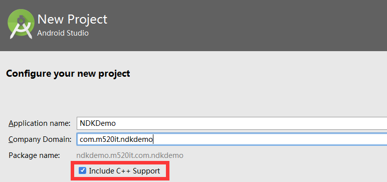

# 项目介绍 #

   
   
   
   
   
   
   
   

# 课程目的 #

1. 了解android安全现状  
2. 对app进行安全防护  
3. 矢量图的使用
4. java加密解密技术  
# UML建模工具 #
## UML介绍 ##
  
1.UML-Unified Model Language 统一建模语言，又称标准建模语言。是用来对软件密集系统进行可视化建模的一种语言。
UML是在开发阶段（非敏捷性开发，敏捷开发追求效率：极限编程，结队编程等等），说明、可视化、构建和书写一个面向对象软件密集系统的制品的开放方法。最佳的应用是工程实践，对大规模，复杂系统进行建模方面，特别是在软件架构层次，已经被验证有效。统一建模语言（UML）是一种模型化语言。模型大多以图表的方式表现出来。一份典型的建模图表通常包含几个块或框，连接线和作为模型附加信息之用的文本。这些虽简单却非常重要，在UML规则中相互联系和扩展。

2.开发中为什么要有图呢？
一图胜千言。文字、代码效率比较低。在项目初期，是没有代码的，最重要的就是架构。做好架构，对于我们后面的业务开发，迭代拓展都很有优势，UML 就在架构中体现了他的优势。
UML 是标准的建模语言，意思就是，别人画的图，你得看明白。如何看明白呢？UML的定义包括UML语义和UML表示法两个元素。
常用的UML 制作软件有很多，  
visio  
startUML  
umlet  
enterprisearchitect  
powerdesigner  
ArgoUML  
Rational Rose  

3.功能模型

相对于Android和javaee,Android对于UML图的设计,稍微轻量一点.

讲解Android中常用的UML图.

从用户的角度展示系统的功能，包括用例图。
对象模型
采用对象、属性、操作、关联等概念展示系统的结构和基础，包括类图、对象图、包图。
动态模型
展现系统的内部行为。 包括序列图(时序图,顺序图)、活动图(流程图)、状态图。  

# 工具安装 #
powerdesigner 
解压，安装，打补丁   
选择开发语言：Sybase\PowerDesigner 15\Resource Files\Object Languages  
Rational Rose  
## UML常用模型图 ##

### 用例图 ###
说清楚一句话

用例之间的关系：  
泛化（generalization）代表一般与特殊的关系。实线，空心三角箭头。箭头指向被继承的用例。    
 在泛化关系中，子用例继承了父用例的行为和含义，子用例也可以增加新的行为和含义或父用例中的行为和含义。

包含（include）：虚线箭头，箭头指向包含者。A包含B，箭头指向A。关系指的是两个用例之间的关系，其中一个用例（称作基本用例，base use case）的行为包含了另一个用例（称作包含用例，inclusion case）的行为。

扩展（extend）关系：不是必要的功能。A可能有B，箭头指向B。将基用例中一段相对独立并且可选的动作，用扩展（Extension）用例加以封装，再让它从基用例中声明的扩展点（Extension Point）上进行扩展，从而使基用例行为更简练和目标更集中 

需求：用户订票，有窗口订票，电话订票，网上订票。窗口订票需要打印车票。网上订票需要发送短信。  
 
### 类图 ###
类图不是为了生成代码的,为了体现整个结构.

依赖(Dependency)：类一方的改动将引起另一方的变动。虚线箭头表示。体现为局部变量、方法的参数或者对静态方法的调用  
泛化(Generalization)：平常所说的类之间的继承关系，用空心实线箭头表示，箭头指向父类  
实现(Realization)：类与接口的关系，用带三角箭头的虚线表示，箭头指向接口    
关联(Association)：类与类之间的联结，它使一个类知道另一个类的属性和方法 ，关联可以是双向的，也可以是单向的。实线箭头表示  
聚合：聚合关系描述的是部分与整体关系的关联，描述了“has a”的关系，汽车整车与发动机、座椅的关系，一般是成员变量。更强的关联关系。  
组合：组合关系是一种更强形式的关联，整合控制成员的生命周期，如公司与部门的关系，比聚合关系更强的关联关系。  

关系紧密程度：泛化 = 实现 > 组合 > 聚合 > 关联 > 依赖    
  

### 时序图 ###
顺序图中包括的建模元素主要有：角色（Actor）、对象（Object）、生命线（Lifeline）、控制焦点（Focus of control）、消息（Message）等等。  
需求，用户支付顺序图：  

### 活动图 ###
带泳道

简单活动图

活动（activity）表示的是某流程中的任务的执行，它可以表示某算法过程中语句的执行.
泳道（swimlane）是活动图中的区域划分，根据每个活动的职责对所有活动进行划分，每个泳道代表一个职责区。  
在活动图中，对于同一个触发时间，可以根据不同的警戒条件转向不同的活动，每个可能的转移是一个分支（branch）  
分叉表示的是一个控制流被两个或多个控制流代替，经过分叉后，这些控制流是并发进行的；  
汇合正好与分叉相反，表示两个或多个控制流被一个控制流代替。  
需求：用户登录到系统的活动图实现。  
 

# 圆形控件 #
实现圆形控件有很多种方式，一般我们采用的方式是：在图片上绘制一个圆形，然后在采用遮罩模式去将图片绘制成圆形。  
这里，我们采用另外一种方式，采用Shader来实现。  
Android提供的Shader类主要是渲染图像以及一些几何图形。
Shader有几个直接子类：
BitmapShader    : 主要用来渲染图像
LinearGradient  :用来进行线性渲染
RadialGradient  : 用来进行环形渲染
SweepGradient   : 扫描渐变---围绕一个中心点扫描渐变就像电影里那种雷达扫描，用来梯度渲染。
ComposeShader   : 组合渲染，可以和其他几个子类组合起来使用。
## 设置控件宽高 ##
获取到屏幕宽高。取出屏幕宽高与传递的宽高的最小值，然后在宽高中取一个较小值作为圆形控件的宽高。  
1. 获取屏幕宽高  

     WindowManager windowManager = (WindowManager) context.getSystemService(
                Context.WINDOW_SERVICE);
2. 获取到背景图片之后，需要将背景干掉，因为我们是重新绘制的，之前的背景不需要了。  

       background = getBackground();
       setBackground(null);

3. 重写ondraw方法：绘制一个圆，到界面上，并且是利用的画笔的着色器    

   	// 将画笔设置bitmapshader
   	createBitmapShader();
   	canvas.drawCircle(getMeasuredWidth() / 2, getMeasuredHeight() / 2, getMeasuredWidth() / 2, circlePaint);

4. 给画笔添加着色器  

   	BitmapShader shader = new BitmapShader(bmp,
   	 Shader.TileMode.CLAMP, Shader.TileMode.CLAMP);// 设置平铺模式
   	circlePaint.setShader(shader);
   	/*
   	CLAMP  ：如果渲染器超出原始边界范围，会复制范围内边缘染色。
   	REPEAT ：横向和纵向的重复渲染器图片，平铺。
   	MIRROR ：横向和纵向的重复渲染器图片，这个和REPEAT 重复方式不一样，他是以镜像方式平铺。
   	*/

5. 根据背景图片来获取Bitmap对象。  
   ​	
   	public Bitmap getBitmap() {
   		// 如果是bitmapdrawable类型，直接获取位图
   	    if (background instanceof BitmapDrawable){
   	        BitmapDrawable bd = (BitmapDrawable) background;
   	        return bd.getBitmap();
   	    }
   		//否则，需要将位图绘制到一个一样大小的图片上
   	    int w = background.getIntrinsicWidth();
   	    int h = background.getIntrinsicHeight();
   	    Bitmap bmp = Bitmap.createBitmap(w, h, Bitmap.Config.ARGB_8888);
   	    Canvas canvas = new Canvas(bmp);
   	    background.setBounds(0, 0, w, h);
   	    background.draw(canvas);
   	    return bmp;
   	}
6. 查看效果，发现一个问题，图片会放大或者压缩。其实，这个地方是因为，如果图片很大，绘制的区域很小，其实相当于是将图片方法了，比如放大器。  
   如何解决呢？我们可以根据绘制的大小和图片的宽高比，来获取一个缩放比率。使用缩放比率来设置着色器。  

   	private void createBitmapShader() {
   	    Bitmap bmp = getBitmap();// 获取图片对象
   	    BitmapShader shader = new BitmapShader(bmp,
   	            Shader.TileMode.CLAMP, Shader.TileMode.CLAMP);
   	    Matrix localM = new Matrix();
   	    float scale = 0;
   	    float bitmapMin = Math.min(bmp.getWidth(), bmp.getHeight());
   	    scale = getMeasuredWidth() * 1.0f / bitmapMin;
   	    localM.setScale(scale, scale);// xy坐标都缩放
   	    shader.setLocalMatrix(localM);// 为着色器设置缩放矩阵
   	    circlePaint.setShader(shader);
   	}  
   

# 九宫格密码锁 #
## 介绍 ##
九宫格密码锁，在越来越多的应用中使用，如果我们能够对九宫格密码做一定的安全处理，我们可以在一定程度上保障信息安全。  
效果图：  
  
## 功能分析 ##
1. 每一个密码按钮，都是由两个圆组成，我们需要自定义，因为系统空间没有这种控件。  
2. 每一个密码按钮有几种状态，正常、绘制、抬起、错误、正确。每种状态通过不同的颜色来区分。  
3. 根据手势，可以将选中的按钮，通过指定颜色的线条来连接起来。  
4. 在手指抬起的时候，就需要去保存密码的地方，进行比较，如果密码正确，修改被选中的按钮的状态。如果错误，修改成另外一种状态。  
5. 需要有一种思想，手指点到某一按钮的附近，可能也应该选中。  
## 功能实现 ##
### 自定义每一个密码按钮 ###
1. 设置画笔属性

       mPaint.setStrokeWidth(5);// 设置画笔宽度
        mPaint.setColor(Color.BLUE);// 设置画笔颜色，颜色需要更改

2. 绘制两个圆，外圆为宽高（这个按钮注定会在Viewgrou中，所以可以先认定，这个宽高肯定是一样的），内圆半径为外圆半径的四分之一。  

       mPaint.setStyle(Paint.Style.STROKE);
        canvas.drawCircle(getMeasuredWidth()/ 2,
                // 外圆的半径，要减去画笔宽度
                getMeasuredHeight() / 2, getMeasuredWidth() / 2 - 5, mPaint);
        mPaint.setStyle(Paint.Style.FILL);
        // 内部的圆的直径，就是外部圆的半径
        canvas.drawCircle(getMeasuredWidth()/ 2,
                getMeasuredHeight() / 2, getMeasuredWidth() / 6, mPaint);
### 自定义密码ViewGroup ###
1. 添加子控件，根据子控件个数。  

   	for (int i = 0; i < gestureCount * gestureCount; i++){
   	     GestureButton gb = new GestureButton(getContext());
   	     addView(gb);
   	 }
2. 为子控件设置宽高。  

   	// 计算子控件的宽高
   	 int size = width / gestureCount / 2;
   	 // 通过确定的值，重新测量子控件，为子控件设置宽高
   	 int cwMode = MeasureSpec.makeMeasureSpec(size, MeasureSpec.EXACTLY);
   	 measureChildren(cwMode, cwMode);

3. 对子控件进行排版，主要是确定子控件的行数和列数。  
     

   	for (int index = 0; index < getChildCount(); index++){
   	     GestureButton gb = (GestureButton) getChildAt(index);
   	     // 排版
   	     int row = 0;// 行号,用来设置宽度距离
   	     int cls = 0;// 列号，用来设置高度距离
   	     row = index / gestureCount;
   	     cls = index % gestureCount;
   	     int tabWidth = width / gestureCount;
   	     int cWidth = gb.getMeasuredWidth();
   	     gb.layout(cls * tabWidth + tabWidth / 2 - cWidth / 2,
   	             row * tabWidth + tabWidth / 2 - cWidth / 2,
   	             cls * tabWidth + tabWidth / 2 + cWidth / 2,
   	             row * tabWidth + tabWidth / 2 + cWidth / 2);
   	
   	 }
4. 监听Viewgroup的触摸事件，根据点击的地方，来绘制手势线。

设置画笔信息  

    	allCircle = new ArrayList<>();
        selectCircle = new ArrayList<>();
        selectIndexs = new ArrayList<>();
        paint = new Paint(Paint.ANTI_ALIAS_FLAG);
        paint.setStyle(Paint.Style.STROKE);
        paint.setColor(Color.RED);
        paint.setAlpha(90);
    	// 画笔快递设置为每一个按钮内圆的直径

监听onTouch方法  

		case MotionEvent.ACTION_DOWN:
	            // 按下，获取按下的位置，判断是否有选中一个圆
	            clearCircle();// 清空所有状态
	            currentX = event.getX();
	            currentY = event.getY();
	            drawSelectCircle(currentX, currentY);
	            break;
	        case MotionEvent.ACTION_MOVE:
	
	            currentX = event.getX();
	            currentY = event.getY();
	            drawSelectCircle(event.getX(), event.getY());
	            break;
	        case MotionEvent.ACTION_CANCEL:
	        case MotionEvent.ACTION_UP:
	            // 抬起或者取消的时候，就让调用者去判定是否密码正确
	            // 将选中的序号，返回给调用者
	            // 可以提供一个延时的线程去清空状态
	            if (callback != null){
					// 如果是校验，需要判定，如果是设置，可以直接返回true，在这个接口方法中，去保存密码即可
	                boolean success = callback.gesture(selectIndexs);
	                if (success){
	                    callback.gestureSuccess();
	                } else {
	                    callback.gestureFail();
	                }
	            }
	            break;

在onDraw方法中，绘制线条  

		if (selectCircle.size() > 0){
	        Path p = new Path();
	        p.moveTo(selectCircle.get(0).x, selectCircle.get(0).y);
	        for (int i = 0; i < selectCircle.size(); i++){
	            GestureCircle gc = selectCircle.get(i);
	            // 修改每一个选中的状态
	            int index = allCircle.indexOf(gc);
	            getChildAt(index).invalidate();
	            p.lineTo(gc.x, gc.y);
	        }
	        p.lineTo(currentX, currentY);
	        canvas.drawPath(p, paint);
	    }

代码已经完成了，但是运行的时候，发现，什么效果都没有，打印日志，可以看出，其实onTouch方法已经执行了。那为什么没有线条信息呢？  
其实原因，我们可以猜测一下，是不是界面没有刷新？不是说，调用invalidate方法就可以更新界面，重新执行onDraw方法么？  
一切，看源码：  

	//原来，调用onDraw方法，是有一个条件的。
	if (!dirtyOpaque) onDraw(canvas);
也就是说，如果dirtyOpaque是true的话，onDraw就不会调用，而dirtyOpaque的值的计算代码如下：  

        final boolean dirtyOpaque = (privateFlags & DIRTY_MASK) == DIRTY_OPAQUE &&
    (mAttachInfo == null|| !mAttachInfo.mIgnoreDirtyState);
当View初始化时，它会调用一个私有方法：computeOpaqueFlags，这里面列出了不透明的三个条件：

       // Opaque if:
       //   - Has a background
       //   - Background is opaque
       //   - Doesn't have scrollbars or scrollbars are inside overlay

View还提供了一个重要的方法：setWillNotDraw，我们看一看它的实现：

    /**
    * If this view doesn't do any drawing on its own, set this flag to
    * allow further optimizations. By default, this flag is not set on
    * View, but could be set on some View subclasses such as ViewGroup.
    *
    * Typically, if you override {@link #onDraw} you should clear this flag.
    *
    * @param willNotDraw whether or not this View draw on its own
    */
    public void setWillNotDraw(boolean willNotDraw) {
        setFlags(willNotDraw ? WILL_NOT_DRAW : 0, DRAW_MASK);
    }

从这个方法的注释，我们可以看出，如果你想重写onDraw的话，你应该调用这个方法来清除flag.  
1）ViewGroup默认情况下，会被设置成WILL_NOT_DRAW，这是从性能考虑，这样一来，onDraw就不会被调用了。

2）如果我们要重要一个ViweGroup的onDraw方法，有两种方法：

 1，在构造函数里面，给其设置一个颜色，如#00000000。

 2，在构造函数里面，调用setWillNotDraw(false)，去掉其WILL_NOT_DRAW flag。  
3）其实，我们定义一个view ，复写onDraw方法，有一个判断，而dispatchDraw连判断都没有。所以自定义view也不一定非得复写onDraw方法，可以复写dispatchDraw方法。

    setBackgroundColor(0x09000000);
    或者
    setWillNotDraw(false) 
    或者
    直接调用dispatchDraw方法
### 绘制完成，提供给调用者公共接口 ###

	public interface IGestureCallback {
	    // 用户校验接口，如果是用来设置的，可以在方法实现用保存密码，返回true
	    boolean gesture(List<Integer> selectIndexs);
	    // 校验或者保存成功
	    void gestureSuccess();
	    // 校验或者保存失败
	    void gestureFail();
	}
## 优化 ##
代码已经完成了，但是我们发现了一些问题：  
1. 手势线，线条交叉的地方相当尖锐。  
2. 密码按钮没有改变状态  
3. 有一种场景，我们没有考虑到，比如，同一行有三个，我选择了第一个，然后连接第三个，现在第二个是没有连接的。  
4. 没有对密码按钮设置自定义的属性来设置各种状态的颜色。  
5. 每次按下，需要清空状态。  
   解决方案：  
6. 交叉尖锐，原因是画笔的过渡默认是有菱角的。

   paint.setStrokeJoin(Paint.Join.ROUND);
     
   画笔的首尾样式：    

   paint.setStrokeCap(Paint.Cap.ROUND);
     
7. 按钮状态改变  

定义常量类，用来列举各种状态  

	public enum SecretType {
 	   DEFAULT,PRESSED,RIGHT,WRONG;// 可以认为，下压和正确的都是同一种颜色，同一种状态
	}
默认状态为default，在按下的时候，设置为pressed，抬起的时候设置为pressed，如果密码错误，设置为wrong。  
在onDraw方法中，就需要去更新这个按钮的状态。

		if (secretType == SecretType.DEFAULT){
	        paint.setColor(colors[0]);
	    } else if (secretType == SecretType.PRESSED){
	        paint.setColor(colors[1]);
	    } else if (secretType == SecretType.RIGHT){
	        paint.setColor(colors[2]);
	    } else if (secretType == SecretType.WRONG){
	        paint.setColor(colors[3]);
	    }  
如果是抬起或者错误，500ms之后，清空界面。  

	if (touchType == TOUCH_TYPE_PRESSED){
		sb.setSecretType(SecretType.PRESSED);
	} else if (touchType == TOUCH_TYPE_UP){
		sb.setSecretType(SecretType.PRESSED);
		postDelayed(mClearRunnable, 1000);
	} else if (touchType == TOUCH_TYPE_ERROR){
		sb.setSecretType(SecretType.WRONG);
		postDelayed(mClearRunnable, 1000);
	}

3. 需要去判断，到底有没有点，在前一个点和当前点所在的直线上。  
   如何判断呢？判断一个点，是否在一条线段上？  
     

       // 获取到最近的一个圆
       private GestureCircle getGestureCircle(float x, float y){
           for (int i = 0; i < allCircle.size(); i++){
               // 只要跟一个圆接近，就可以跳出循环了
               GestureCircle gc = allCircle.get(i);
               if (gc.judge(x, y)){
                   return gc;
               }
           }
           return null;
       }
       
       private void drawSelectCircle(float currentX, float currentY) {
           // 判断这个点，是否跟某一个圆接近
           GestureCircle gc = getGestureCircle(currentX, currentY);
           if (gc != null){
               // 有一个圆被选中了
               if (selectCircle.size() == 0){
                   selectCircle.add(gc);
               } else {
                   // 如果有多个，需要判断，选中的点，和最近的那个点，是否有未选中的点
                   final GestureCircle lastCircle = selectCircle.get(selectCircle.size() - 1);
                   int ab = (int) getTwoPointLength(gc.x, gc.y, lastCircle.x, lastCircle.y);
                   List<GestureCircle> temp = new ArrayList<>();
                   // 新的点，跟最后一个点连成线
                   for (int i = 0; i < allCircle.size(); i++){
                       // 取出每一个点
                       GestureCircle gc1 = allCircle.get(i);
                       if (!gc1.equals(gc) && !gc1.equals(lastCircle) && !selectCircle.contains(gc1)){
                           // 不跟自己比较
                           // 分别计算三条线段
                           int ac = (int) getTwoPointLength(gc1.x, gc1.y, lastCircle.x, lastCircle.y);
                           int bc = (int) getTwoPointLength(gc.x, gc.y, gc1.x, gc1.y);
                           if (ac + bc == ab){
                               // 表示在一条直线上
                               // 将这个点加入到临时的点中
                               temp.add(gc1);
                               selectIndexs.add(i);
                           }
                       }
                   }
                   // temp 就是中间的点，但是中间的点需要排序，因为，可能是从左到右滑动，也可能是从右到左滑动
                   // 排序的标准就是，跟lastCircle比较近的放在前面
                   Collections.sort(temp, new Comparator<GestureCircle>() {
                       @Override
                       public int compare(GestureCircle c1, GestureCircle c2) {
       
                           return (int) (getTwoPointLength(c1.x, c1.y, lastCircle.x, lastCircle.y) - getTwoPointLength(c2.x, c2.y, lastCircle.x, lastCircle.y));
                       }
                   });
                   selectCircle.addAll(temp);
                   if (!selectCircle.contains(gc)){
                       // 还没有选过
                       selectCircle.add(gc);
                       selectIndexs.add(allCircle.indexOf(gc));
                   }
       
               }
           }
       }
4. 自定义属性  

   	<declare-styleable name="GestureSecretLayout">
   	    <!--行列
   	   按钮的各种状态颜色，如果不传递，则为默认颜色
   	   外圆的宽度
   	   线条的颜色-->
   	    <attr name="secret_count" format="integer"/>
   	    <attr name="type_default" format="color"/>
   	    <attr name="type_pressed" format="color"/>
   	    <attr name="type_right" format="color"/>
   	    <attr name="type_wrong" format="color"/>
   	    <attr name="circle_width" format="dimension"/>
   	    <attr name="touch_color" format="color"/>
   	</declare-styleable>

在布局中找到各个属性  

		TypedArray attributes = context
	            .obtainStyledAttributes(attrs, R.styleable.GestureSecretLayout);// 获取到属性工具类
	    gestureCount = attributes.getInteger(R.styleable.GestureSecretLayout_secret_count, DEFAULT_COUNT);
	    circle_width = attributes.getDimension(R.styleable.GestureSecretLayout_circle_width, 5);
	    colors[0] = attributes.getColor(R.styleable.GestureSecretLayout_type_default, Color.BLUE);
	    colors[1] = attributes.getColor(R.styleable.GestureSecretLayout_type_pressed, Color.GREEN);
	    colors[2] = attributes.getColor(R.styleable.GestureSecretLayout_type_right, Color.YELLOW);
	    colors[3] = attributes.getColor(R.styleable.GestureSecretLayout_type_wrong, Color.RED);
	    touch_color = attributes.getColor(R.styleable.GestureSecretLayout_touch_color, Color.GRAY);//Color.GRAY;// 默认是灰色的
	    attributes.recycle();// 需要回收资源

5. 清空界面各种状态  

   	private void clearCircle() {
   	    // 将每一个选中的按钮的状态还原
   	    for (int i = 0; i < selectIndexs.size(); i++){
   	        // 这些都是选中的
   	        GestureButton gb = (GestureButton) getChildAt(selectIndexs.get(i));
   	        gb.setSecretType(SecretType.DEFAULT);
   	        gb.invalidate();
   	    }
   	    selectCircle.clear();
   	    selectIndexs.clear();
   	    touchType = 0;
   	    invalidate();
   		removeCallbacks(mClearRunnable);// 移除延时任务。避免延时过程中，用户再次点击导致状态错乱
   	}

## 密码保存 ##
密码保存方式：  
一般，我们将一些关键信息都写在这些地方：代码中，配置文件中，sd卡中。等等。但是，如果只是单一的将明文信息放在这些地方保存，是没有安全保证的。  
对于手势密码的保存，今天我们通过加密之后保存到文件中，通过NDK对数据进行加密辅助。  
### 加密流程 ###
1. 通过native方法，生成需要AES加密的随机数和缓冲初始向量。利用这两个值去初始化AES加密工具。  
2. 通过java代码进行AES加密。  
3. 手势密码数据，通过此工具类进行加密。  

   	public class GestureJniUtil {
   	public static native byte[] getKeyValue();// c++ 实现强随机因子
   	public static native byte[] getIv();// c++实现缓冲初始向量
   	
   	private static byte[]keyValue;
   	private static byte[]iv;
   	
   	private static SecretKey key;
   	private static AlgorithmParameterSpec paramSpec;// 加密参数的透明规范
   	private static Cipher ecipher;// 加密解密工具类
   	
   	static {
   	    System.loadLibrary("gesture");
   	    keyValue = getKeyValue();
   	    iv = getIv();
   	    if(null != keyValue && null !=iv) {
   	        KeyGenerator kgen;
   	        try {
   	            // 秘钥生成器
   	            kgen = KeyGenerator.getInstance("AES");
   	            // 加密用的强随机数，传入指定的算法和提供者的包名，包名可以不用传递，系统自己找。优先匹配找到的第一个
   	            SecureRandom random = SecureRandom.getInstance("SHA1PRNG","Crypto");
   	            random.setSeed(keyValue);// 重新设置随机因子。这个随机因子是补充到默认之上，所以不会降低随机概率
   	            kgen.init(128,random);// 通过指定的随机数来初始化随机源
   	            key =kgen.generateKey();// 获取秘钥
   	            paramSpec =new IvParameterSpec(iv);// 缓冲区初始向量
   	            ecipher = Cipher.getInstance("AES/CBC/PKCS5Padding");// 初始化加密解密工具，参数为转换的名称
   	
   	        } catch (NoSuchAlgorithmException e) {
   	        } catch (NoSuchPaddingException e) {
   	        } catch (NoSuchProviderException e) {
   	            e.printStackTrace();
   	        }
   	    }
   	}

       /**加密**/
       public static String encode(String msg) {
           String str ="";
           try {
               //用密钥和一组算法参数初始化此 cipher
               ecipher.init(Cipher.ENCRYPT_MODE,key,paramSpec);
               //加密并转换成16进制字符串
               str = asHex(ecipher.doFinal(msg.getBytes()));
           } catch (BadPaddingException e) {
           } catch (InvalidKeyException e) {
           } catch (InvalidAlgorithmParameterException e) {
           } catch (IllegalBlockSizeException e) {
           }
           return str;
       }
       /**解密**/
       public static String decode(String value) {
           try {
               ecipher.init(Cipher.DECRYPT_MODE,key,paramSpec);
               return new String(ecipher.doFinal(asBin(value)));
           } catch (BadPaddingException e) {
           } catch (InvalidKeyException e) {
           } catch (InvalidAlgorithmParameterException e) {
           } catch (IllegalBlockSizeException e) {
           }
           return"";
       }
       
       /**转16进制**/
       private static String asHex(byte buf[]) {
           StringBuffer strbuf =new StringBuffer(buf.length * 2);
           int i;
           for (i = 0;i <buf.length;i++) {
               if (((int)buf[i] & 0xff) < 0x10)//小于十前面补零
                   strbuf.append("0");
               strbuf.append(Long.toString((int)buf[i] & 0xff, 16));
           }
           return strbuf.toString();
       }
       /**转2进制**/
       private static byte[] asBin(String src) {
           if (src.length() < 1)
               return null;
           byte[]encrypted =new byte[src.length() / 2];
           for (int i = 0;i <src.length() / 2;i++) {
               int high = Integer.parseInt(src.substring(i * 2, i * 2 + 1), 16);//取高位字节
               int low = Integer.parseInt(src.substring(i * 2 + 1, i * 2 + 2), 16);//取低位字节
               encrypted[i] = (byte) (high * 16 +low);
           }
           return encrypted;
       }

   }

涉及到的几个常见类：  
1. SecureRandom 加密中使用的强随机数，区别于伪随机数。  
2. KeyGenerator 秘钥生成器。  
3. SecretKey 秘钥对象。  
4. IvParameterSpec 缓冲区初始向量值。  
5. Cipher 加密解密工具类。  

但是，这种方式的加密，其实也不是绝对安全的。只能说是，提高一定的安全性。so的逆向比android困难很多，但是也不是不能做。使用专门的IDA工具对so进行分析，也可以逆向的。所以，一般大公司的操作方式，是对so文件进行加壳。  

### androidstudio进行NDK开发 ###
我们可以采用多种方式来获取到so文件。  
1. 利用eclipse生成so文件，然后全部都拷贝到as中。这种方式我们最熟悉。  
2. 利用as直接做as开发。这种也有多种开发形式。

#### 1. 使用gradle的体验版本来做NDK开发。  ####
  使用体验版本的gradle experimental插件：classpath "com.android.tools.build:gradle-experimental:0.8.0"  
体验版本的experimental插件版本对应的gradle版本如下：  
   	   
体验版本很方便，因为我们再也不需要去生成头文件，也不需要android.mk文件等等，仅仅需要做相应的插件配置，那么gradle工具就会帮助我们去交叉编译生成so库。  
  1.带项目的build.gradle中，  

	         使用插件去替代原来的gradle工具
			//classpath 'com.android.tools.build:gradle:2.2.0'
	        classpath "com.android.tools.build:gradle-experimental:0.8.0"
  2.项目中的gradle改变比较多。

	    // 用com.android.model.application 代替 com.android.application  
	    // 将原来的android配置用 model{}包起来  
		model {
   		   android {
           compileSdkVersion = 24// 键值之间用=连接
           buildToolsVersion = "25.0.3"
    
           defaultConfig.with {
               applicationId = "com.m520it.tounanew"
               minSdkVersion.apiLevel  = 19// 区别于默认的写法
               targetSdkVersion.apiLevel = 23
               versionCode = 1
               versionName = "1.0"
           }
           compileOptions.with {
               sourceCompatibility = JavaVersion.VERSION_1_7// 增加java编译版本
               targetCompatibility = JavaVersion.VERSION_1_7
           }
        }
        android.buildTypes {
           release {
               minifyEnabled = false
               proguardFiles.add(file('proguard-rules.pro'))// += 调用add方法
           }
        }
        android.ndk {
           moduleName = "gesture"// so文件的名字
           cppFlags.add("-I${file("src/main/jni")}".toString())
           cppFlags.add("-DANDROID")
           cppFlags.add("-fexceptions")
           cppFlags.add("-frtti")
           stl = "gnustl_static"
           ldLibs.add("log")// 增加其他三方文件
           ldLibs.add("GLESv2")
        }
        android.productFlavors {
           create("arm7") {
               ndk.abiFilters.add("armeabi-v7a")
           }
           create("arm8") {
               ndk.abiFilters.add("arm64-v8a")
           }
    
        }
        }
  3.之后，编写c代码。  
  4.重新编译之后，就可以运行了。so文件，可以在apk中解压之后查看。
#### 2. 创建一个支持C/C++的项目开发。 ####
其实as中已经为我们提供了最简洁的NDK 开发，我们只需要在创建工程的时候，选中支持c++即可，那么项目就会默认帮助我们创建默认的CMake脚本以及默认的cpp文件。  
在使用CMake脚本的时候，可以参考 https://cmake.org/cmake/help/latest/manual/cmake-commands.7.html。  
并且，我们可以按照格式，添加我们自己的c/c++文件并且编译。相当方便！  

  

  1.如果是自己的预编译的so文件，在CMake脚本中，复制一个add_libary，配置自己的文件  
  2.在target_link_libaries 中增加自己的so文件名  
即可。 
#### 3. 使用正式版本完成NDK开发。 ####

1.安装NDK  
   2.在项目中的gradle.properties 配置这句话

	    android.useDeprecatedNdk=true  

   3.查看是否已经配置好NDK  
   4.定义native方法  
   5.生成头文件（需要clean工程并重新编译，在控制台cd 到 java目录下，输入命令  

     javah -jni -encoding utf-8 com.xxx.xxx.jnitest） 

，可能报错，编码不正确，由于JDK是国际版的，在编译的时候，如果我们没有用-encoding参数指定我们的JAVA源程序的编码格式，则javac.exe首先获得我们操作系统默认采用的编码格式。   
   6.刷新文件，将生成的头文件复制到jni目录（创建jni文件夹，与java同级）下  
   7.编写c代码  
   8.编写gradle，并重新编译  

	defaultConfig{
	     ndk{
	    		moduleName "gesture"              //对应c文件名
	    		abiFilters "armeabi", "armeabi-v7a", "x86"      //生成对应	平台so库，去掉则默认生成全部so库
		}
	}

### 密码校验 ###
在手势绘制的回调方法中，就可以开始校验。  
1. 如果是进入应用，是校验，需要将绘制的手势跟本地已经保存的手势进行比较。  
2. 如果是设置手势锁，那么，校验的方法可以用来做保存的工作，如果保存成功，则返回true。  

   		@Override
   	     public boolean onGestureLine(List<Integer> chooseIndexs) {
   	         // 从本地文件中读取。
   	         String lock = chooseIndexs.toString();
   	         // 跟文件中的数据进行比较
   	         return GestureJniUtil.encode(lock).equals(decoder);
   	     }